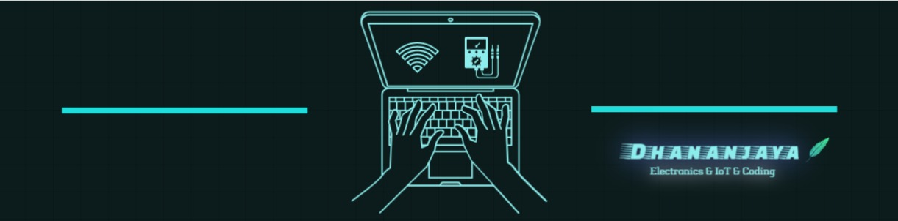

<h1 align="center">
 
</h1>

<h1 align="center">Hi 👋, I'm Dhananjaya</h1>
<h3 align="center">Undergraduate Student at Eastern University, Sri Lanka</h3>

  

 
   
  

  
  
  ### 🚀 About Me
  
  - 🔭 I'm currently working on **Smart Baby Cradle System with IoT technologies**
  - 🌱 I'm currently studying at **Eastern University, Sri Lanka**  
  - 💬 Ask me about **IoT, Web Development, and Programming**
  - 📫 How to reach me: **w.a.d.dananjaya@gmail.com**
  - ⚡ Fun fact: **Call me as Dhana**
  - 🎯 Goals: **To become a skilled Full Stack Developer**
  

 

---

<h2 align="center">🌟 GitHub Statistics</h2>

  

  

---

<!-- Snake Game Repo -->

  

 

---

<h2 align="center">🤝 Connect with me</h2>

  

---

<h2 align="center">🛠️ Languages and Tools</h2>

  
 
 
 
 
 
 
 
 
 
 
 
 
 

---

  
### ✨ *"Code is like humor. When you have to explain it, it's bad."* ✨

**Thanks for visiting my profile! Have a great day! 😊**

